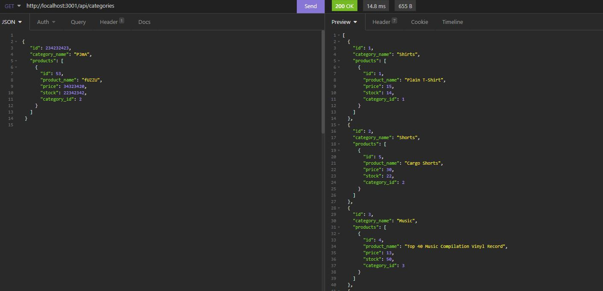

# E-Commerce Backend
---
## Description
Using sequelize and mysql to use routes to perform CRUD operations.

<a href="https://watch.screencastify.com/v/kKDYVHIqPsZQV0K8l5zL">Click here to go to view a video walk through.</a>

 
 

 
 

## Table of Contents
    - Installation
    - Usage
    - License
    - Contributing
    - Tests
    - Questions

## Installation
Git clone the repository, npm install, input your own user info for mysql, run SOURCE schema.sql in the db terminal to use the database, npm run seeds, and then npm start.

## Usage
Once the program is running on the local host, you can use insomnia to test out the routes.

## License
license used : MIT License

 

<a href="https://opensource.org/licenses/MIT">Click here for license info.</a>

## Contributing
Courtney Long

## Tests

None

 

--- 

 

## Questions

If you have any questions, feel free to contact me:
<ul>
<li> Github : <a href="https://github.com/courtbourt12">Click here to go to my GitHub page.</a> </li>
<li> Email : courtneylong877@gmail.com </li>
</ul>